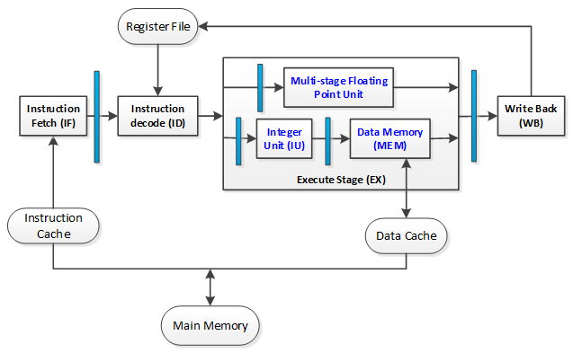
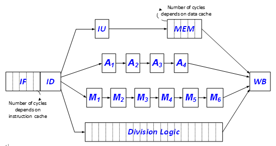

# MIPS Instruction Set Based CPU

This is an implementation for a simplified MIPS CPU using high level programming language. The considered simulator adopts a multi-cycle pipline processor to dynamically schedule instruction execution and employs caches in order to dynamically schedule instruction execution and employs caches in order to expedite memory access.

## Instruction Set
Generally speaking, this implementation supports the following MIPS instructions,

Instruction Class | Instruction Monemonic
------------------| ---------------------
Data Transfers    | LW, SW, L.D, S.D
Arithmetic / Logical | DADD, DADDI, DSUB, DSUBI, AND, ANDI, OR, ORI, ADD.D, MUL.D, DIV.D, SUB.D
Control           | J, BEQ, BNE
Special Purpose   | HLT(to stop fetching new instructions)

## Architecture
The overall architecture is shown in the below figure, taken from the project description of CMSC 611 spring 2014 (so are the other figures). Generally speaking, it includes two major parts: Memory and CPU. 

Memory includes **instruction cache (I-Cache)**, **data cache (D-Cache)** and **main memory**. D-Cache is a **2-way** set associative with a total of **four 4-words** blocks, associated with **least-recently-used-block-replacement strategy** and **write-allocate** policy for **write-back** strategy; I-Cache is **read-only** and used in the **instruction fetch stage** while D-Cache is accessed in **Memory stage**. Both I-Cache and D-Cache are connected to main memory using a shared bus. Any cache miss shall **wait** if main memory is busy serving the other cache and **I-Cache** takes priority if both caches try to access the memory at the same time. Main memory is accessable through **one-word-wise bus**. The access time for memory, I-Cache (hit time) and D-Cache (hit time) are specified in input configuration file, namely "config.txt". The main memory is **2-way interleaved**, thus the access time for 2 **consecutive** words equals **T+K** cycles, where **T** is the access time for main memory and **K** is the access of cache, both specified in "config.txt". Memory access is **word-alignment enforced**.

Again the CPU pipeline is shown in the above figure, which is designed for dynamic schedule of instruction execution. It includes four stages: **nstruction Fetch (IF)**, **Instruction Decoding and Operand Reading (ID)**, **Execution (EX)** and **Write Back (WB)**. EX includes both **ALU** and data access **Mem** stages. There are four distinct ALU units: *Integer Arithmetic*, *FP Add/Substract*, *FP Multiplication* and *FP division*. Among them, **Integer Unit (IU)** always takes **one** cycle for execution, while **FP units** can be **piplined or not** and may take **different** cycles (latency), according the their specification in the "config.txt" file. For simplicity, FP division is **not pipelined** and needs **20** cycles to complete. Note that the number of cycles for the instruction fetch (IF) and data access (MEM) stages depends on the cache performance, e.g. miss or hit. For load and store instructions, the address is calculated by **IU** before the data cache is accessed. Meanwhile, integer instructions, e.g., DADD, that do not require memory access will still spend only **1** cycle in MEM stage, before advancing to WB stage.

The instruction level parallelism is achieved with **in-order** instruction issue, **out-of-order** execution and **out-of-order** completion. 
